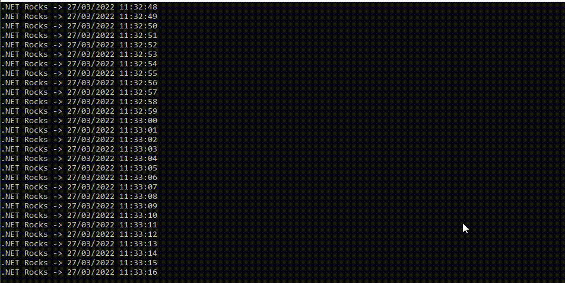

# AspNetWebSockets 

WebSocket is commonly used for client communication and web server through messaging without the need for a new connection. That is, the instances do not need recomunication or re-auth.

This application was made helped with this references: 
- [article 1 Balta.io](https://balta.io/blog/aspnet-websockets?utm_source=YouTube&utm_campaign=social-to-blog&utm_content=video-websockets&utm_medium=video-description)

- [video 1 Balta.io](https://youtu.be/TZoav69FJ7I)
- [Minimal API (how server ws was made by)](https://docs.microsoft.com/en-us/aspnet/core/fundamentals/minimal-apis?view=aspnetcore-6.0)
- [.NET 6 SDK ](https://dotnet.microsoft.com/en-us/download/dotnet/6.0)